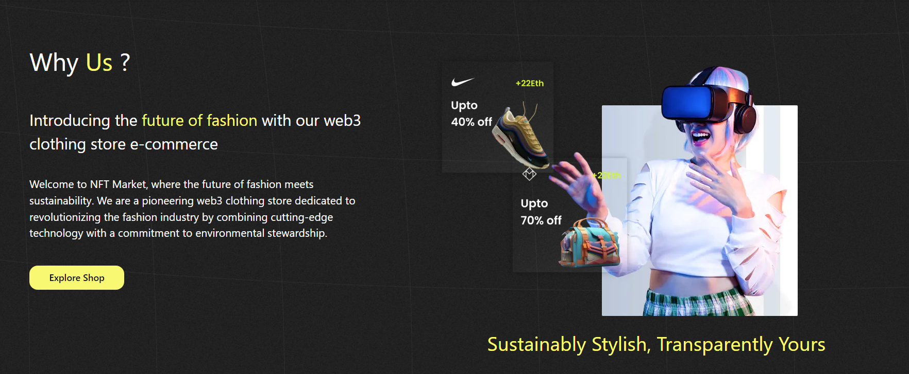
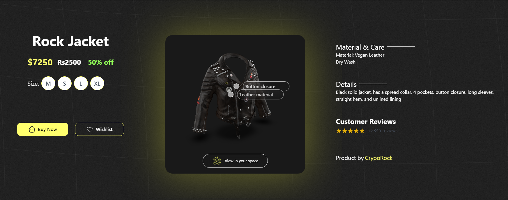
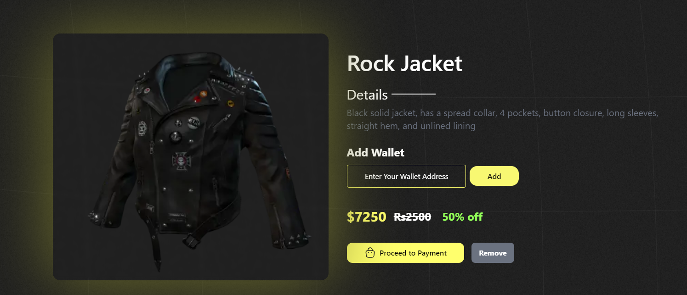

# Meta-shopping: Revolutionizing Sustainable Fashion in the Metaverse

Meta-shopping is a cutting-edge metaverse shopping platform seamlessly integrated with the web3 space. This innovative platform allows users to experience products through augmented reality (AR) and virtual reality (VR), bringing a new dimension to online shopping. Moreover, all items can be purchased as NFTs, ensuring a unique and secure transaction. Meta-shopping is designed to be a compact, user-friendly platform offering the latest in branded sustainable fashion, catering to the needs and preferences of today's generation.




## Getting Started

First, run the development server:

```bash
npm run dev
```

Open [http://localhost:3000](http://localhost:3000) with your browser to see the result.